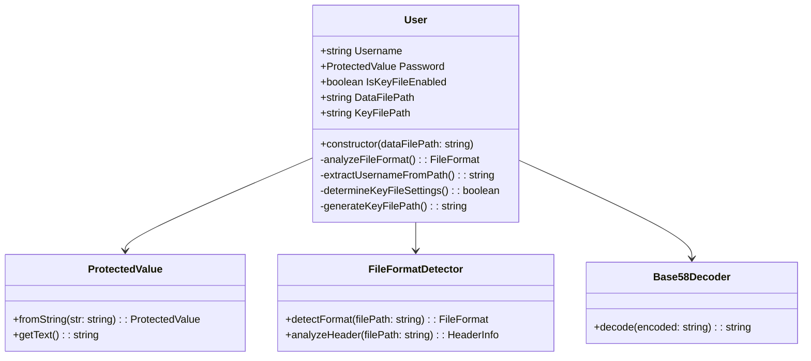

# Design Document: User Class

## Overview

The User class provides a unified interface for handling both PassXYZ and KeePass database files with automatic format detection and configuration. The class analyzes file paths and headers to determine the appropriate file type, then configures username extraction, key file settings, and file paths accordingly.

The design leverages existing codebase utilities including ProtectedValue for secure password storage, FileExt and FileHeader constants for file extensions and headers, and file header analysis capabilities from the KdbxHeader class.

## Constants Usage

The implementation uses constants from `lib/defs/consts.ts`:
- `FileHeader.Data` for "pass_d_" prefix
- `FileHeader.Datax` for "pass_e_" prefix  
- `FileHeader.Key` for "pass_k_" prefix
- `FileExt.Data` for ".xyz" extension
- `FileExt.KeyV2` for ".keyx" extension (used for both PassXYZ and KeePass key files)
- `FileExt.KeePass` for ".kdbx" extension

## Architecture

The User class follows a constructor-based initialization pattern where all configuration is determined during object creation. This ensures immutable configuration once the object is created, reducing the potential for inconsistent states.



## Components and Interfaces

### User Class

The main User class with the following public interface:

```typescript
class User {
    readonly Username: string;
    readonly Password: ProtectedValue;
    readonly IsKeyFileEnabled: boolean;
    readonly DataFilePath: string;
    readonly KeyFilePath: string;
    readonly fileSize: number;
    readonly lastModified: Date;
    readonly icon: string;
    
    constructor(dataFilePath: string);
}
```

### File Format Detection

Internal file format detection logic:

```typescript
enum FileFormat {
    PassXYZ_Data = 'passxyz_data',
    PassXYZ_DataWithKey = 'passxyz_data_with_key',
    KeePass = 'keepass'
}

interface FileFormatInfo {
    format: FileFormat;
    hasKeyFile: boolean;
    base58String?: string;
}
```

### Base58 Decoder

Utility for decoding base58 strings from PassXYZ filenames:

```typescript
interface Base58Decoder {
    decode(encoded: string): string;
    isValidBase58(str: string): boolean;
}
```

## Data Models

### User Properties

- **Username**: `string` - Derived from filename (KeePass) or decoded base58 (PassXYZ)
- **Password**: `ProtectedValue` - Initialized as empty, to be set by consumer
- **IsKeyFileEnabled**: `boolean` - Determined by file format analysis
- **DataFilePath**: `string` - The input file path provided to constructor
- **KeyFilePath**: `string` - Generated path for key file or empty string
- **fileSize**: `number` - Size of the data file in bytes
- **lastModified**: `Date` - Last modification date of the data file
- **icon**: `string` - Icon identifier based on file format ('keepass' or 'passxyz')

### File Format Patterns

PassXYZ filename patterns:
- Data without key: `${FileHeader.Data}{base58_string}${FileExt.Data}`
- Data with key: `${FileHeader.Datax}{base58_string}${FileExt.Data}`
- Key file: `${FileHeader.Key}{base58_string}${FileExt.KeyV2}`

KeePass filename patterns:
- Data file: `{filename}${FileExt.KeePass}`
- Key file: `{filename}${FileExt.KeyV2}`

## Implementation Strategy

### Constructor Flow

1. **Store DataFilePath**: Save the provided file path
2. **Get File Stats**: Read file size and last modified date using fs.statSync()
3. **Analyze File Format**: Determine if PassXYZ or KeePass based on filename pattern
4. **Set Icon**: Assign appropriate icon based on detected format
5. **Extract Username**: Use appropriate extraction method based on format
6. **Determine Key File Settings**: Set IsKeyFileEnabled based on format analysis
7. **Generate Key File Path**: Create KeyFilePath if key file is enabled
8. **Initialize Password**: Create empty ProtectedValue for later assignment

### File Format Detection Algorithm

```typescript
private analyzeFileFormat(filePath: string): FileFormatInfo {
    const filename = path.basename(filePath);
    
    // Check for PassXYZ patterns using FileHeader and FileExt constants
    if (filename.startsWith(FileHeader.Data) && filename.endsWith(FileExt.Data)) {
        const base58String = filename.slice(FileHeader.Data.length, -FileExt.Data.length);
        return {
            format: FileFormat.PassXYZ_Data,
            hasKeyFile: false,
            base58String
        };
    }
    
    if (filename.startsWith(FileHeader.Datax) && filename.endsWith(FileExt.Data)) {
        const base58String = filename.slice(FileHeader.Datax.length, -FileExt.Data.length);
        return {
            format: FileFormat.PassXYZ_DataWithKey,
            hasKeyFile: true,
            base58String
        };
    }
    
    // Default to KeePass format
    return {
        format: FileFormat.KeePass,
        hasKeyFile: false // Will be determined by header analysis
    };
}
```

### Username Extraction

For KeePass files:
```typescript
private extractKeePassUsername(filePath: string): string {
    return path.basename(filePath, path.extname(filePath));
}
```

For PassXYZ files:
```typescript
private extractPassXYZUsername(base58String: string): string {
    return this.base58Decoder.decode(base58String);
}
```

### Key File Path Generation

```typescript
private generateKeyFilePath(dataFilePath: string, format: FileFormat): string {
    if (!this.IsKeyFileEnabled) {
        return '';
    }
    
    const dir = path.dirname(dataFilePath);
    const basename = path.basename(dataFilePath, path.extname(dataFilePath));
    
    if (format === FileFormat.PassXYZ_DataWithKey) {
        // Replace FileHeader.Datax with FileHeader.Key and use FileExt.KeyV2
        const keyFilename = basename.replace(FileHeader.Datax, FileHeader.Key) + FileExt.KeyV2;
        return path.join(dir, keyFilename);
    } else {
        // KeePass key file
        return path.join(dir, basename + FileExt.KeyV2);
    }
}
```

## Error Handling

The User class handles various error conditions:

1. **File Not Found**: Constructor validates that the data file exists
2. **Invalid File Format**: Graceful fallback to KeePass format for unrecognized patterns
3. **Invalid Base58**: Validation of base58 strings in PassXYZ filenames
4. **Header Analysis Errors**: Fallback to filename-based detection if header reading fails

Error handling follows existing codebase patterns using KdbxError for consistency:

```typescript
if (!fs.existsSync(dataFilePath)) {
    throw new KdbxError(ErrorCodes.InvalidArg, `File not found: ${dataFilePath}`);
}
```

## Testing Strategy

### Dual Testing Approach

The implementation will use both unit tests and property-based tests to ensure comprehensive coverage:

**Unit Tests**: Focus on specific examples, edge cases, and error conditions
- Test specific filename patterns (PassXYZ and KeePass)
- Test base58 decoding with known values
- Test error conditions (file not found, invalid formats)
- Test integration with existing ProtectedValue and FileExt utilities

**Property Tests**: Verify universal properties across all inputs
- Test that constructor always produces valid User objects
- Test that key file paths are correctly generated for all valid inputs
- Test that username extraction works for all valid filename patterns
- Test round-trip properties for base58 encoding/decoding

### Property-Based Testing Configuration

Each property test will run a minimum of 100 iterations using a property-based testing library (fast-check for TypeScript). Tests will be tagged with comments referencing the design document properties:

**Tag format**: `Feature: user-class, Property {number}: {property_text}`

Each correctness property will be implemented by a single property-based test that validates the universal behavior across randomized inputs.

## Correctness Properties

*A property is a characteristic or behavior that should hold true across all valid executions of a system—essentially, a formal statement about what the system should do. Properties serve as the bridge between human-readable specifications and machine-verifiable correctness guarantees.*

Based on the prework analysis and property reflection, the following correctness properties validate the User class behavior:

**Property 1: User class structure consistency**
*For any* valid DataFilePath, creating a User instance should result in an object with all required properties of correct types: Username (string), Password (ProtectedValue), IsKeyFileEnabled (boolean), DataFilePath (string), and KeyFilePath (readonly string)
**Validates: Requirements 1.1, 1.2, 1.3, 1.4, 1.5**

**Property 2: File format detection accuracy**
*For any* filename matching PassXYZ patterns (`${FileHeader.Data}*${FileExt.Data}` or `${FileHeader.Datax}*${FileExt.Data}`), the User class should detect PassXYZ format, and for any other filename, it should default to KeePass format
**Validates: Requirements 2.1, 2.2, 2.3, 2.4**

**Property 3: Username extraction correctness**
*For any* valid file path, the Username should be correctly extracted: filename without extension for KeePass files, and base58-decoded string for PassXYZ files
**Validates: Requirements 3.1, 3.2, 3.3, 3.4**

**Property 4: Key file detection consistency**
*For any* PassXYZ file with `${FileHeader.Datax}` prefix, IsKeyFileEnabled should be true, and for any PassXYZ file with `${FileHeader.Data}` prefix, IsKeyFileEnabled should be false
**Validates: Requirements 4.3, 4.4**

**Property 5: Key file path generation**
*For any* User instance where IsKeyFileEnabled is true, KeyFilePath should be generated with the appropriate extension (FileExt.KeyV2 for KeePass, FileExt.Key for PassXYZ), and when IsKeyFileEnabled is false, KeyFilePath should be empty
**Validates: Requirements 4.1, 4.2, 4.5**

**Property 6: Constructor data preservation**
*For any* valid DataFilePath provided to the constructor, the resulting User instance should have its DataFilePath property set to the exact same value
**Validates: Requirements 5.1**

**Property 7: Constructor initialization completeness**
*For any* valid DataFilePath, the constructor should properly initialize Username and IsKeyFileEnabled based on the detected file format, and generate KeyFilePath if needed
**Validates: Requirements 5.3, 5.4, 5.5**

**Property 8: Error handling consistency**
*For any* invalid input or error condition (file not found, invalid format, header analysis failure), the User class should handle errors gracefully using existing error patterns and fall back to filename-based detection when appropriate
**Validates: Requirements 6.2, 6.4, 7.5**

**Property 9: Integration with existing utilities**
*For any* User instance, the Password property should be a ProtectedValue instance and generated file paths should use existing FileExt constants
**Validates: Requirements 7.1, 7.2**

**Property 10: Base58 round-trip consistency**
*For any* valid base58 string, encoding then decoding should produce an equivalent value, ensuring username extraction accuracy for PassXYZ files
**Validates: Requirements 3.4**